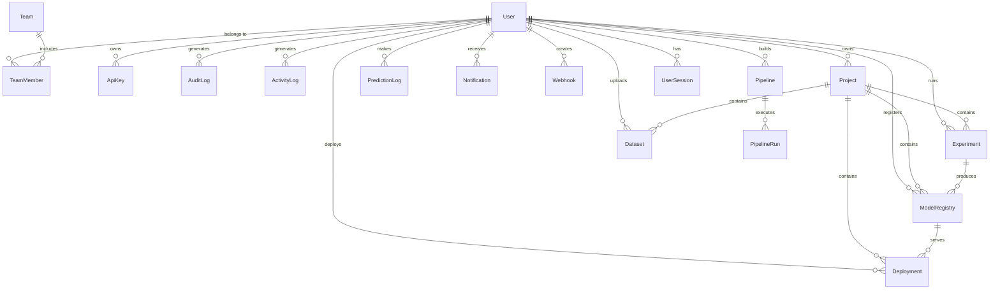

# Entity-Relationship Diagram

## Overview

18 tables across 7 domains: Users & Auth, Projects, ML Pipeline, Data, Operations, Monitoring, Marketplace.

## Mermaid ER Diagram

## Table Descriptions

| Table | Domain | Description |
|-------|--------|-------------|
| users | Auth | Registered users with roles, MFA, OAuth |
| teams | Auth | Groups for collaboration |
| team_members | Auth | User-team membership (junction) |
| api_keys | Auth | Programmatic access keys |
| user_sessions | Auth | Active login sessions |
| projects | Projects | ML project containers |
| experiments | ML Pipeline | Training run records |
| model_registry | ML Pipeline | Trained model artifacts |
| deployments | ML Pipeline | Deployed model endpoints |
| pipelines | ML Pipeline | Multi-step pipeline definitions |
| pipeline_runs | ML Pipeline | Pipeline execution records |
| datasets | Data | Uploaded dataset metadata |
| prediction_logs | Data | Inference request history |
| notifications | Operations | User notification messages |
| webhooks | Operations | External integration callbacks |
| audit_logs | Monitoring | System audit trail |
| activity_logs | Monitoring | User activity timeline |
| marketplace_items | Marketplace | Community model templates |

## Key Relationships

- User -> Projects (1:N): A user can own multiple projects
- Project -> Experiments (1:N): A project contains many experiment runs
- Experiment -> ModelRegistry (1:N): An experiment can produce multiple registered models
- ModelRegistry -> Deployment (1:N): A registered model can have multiple deployments
- Pipeline -> PipelineRun (1:N): A pipeline can be executed multiple times
- User <-> Team (M:N): Through team_members junction table
