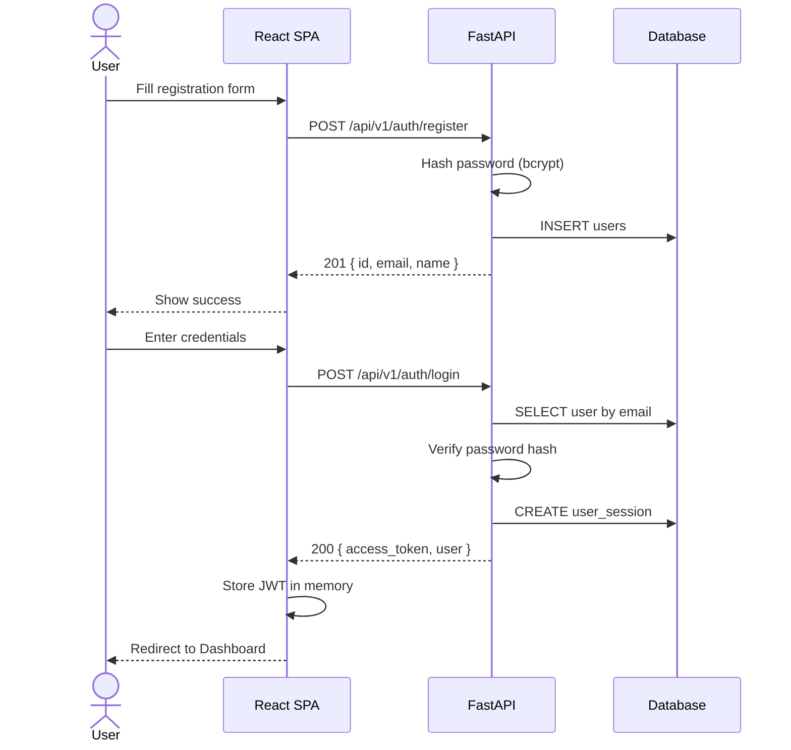
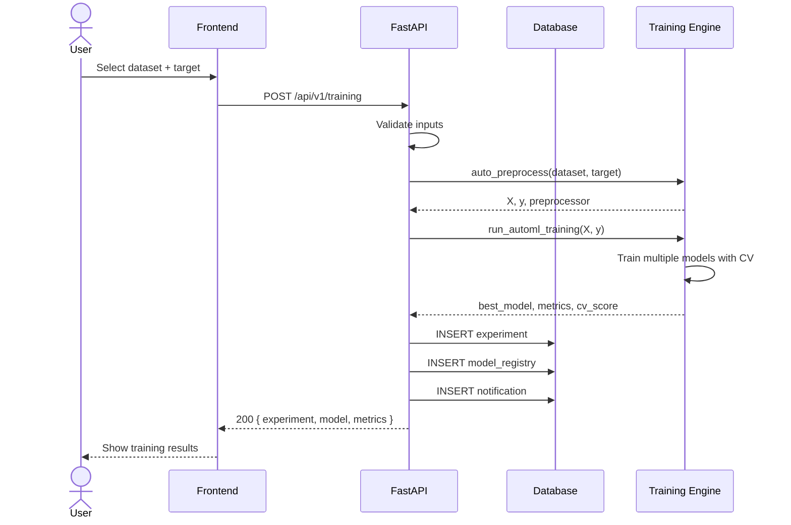
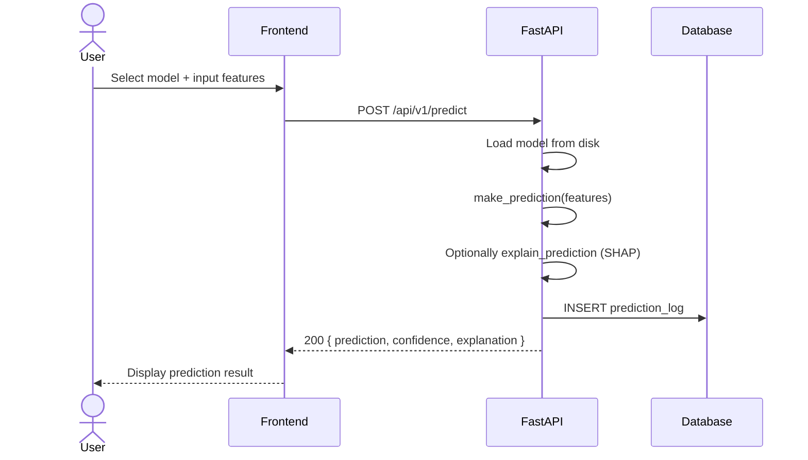
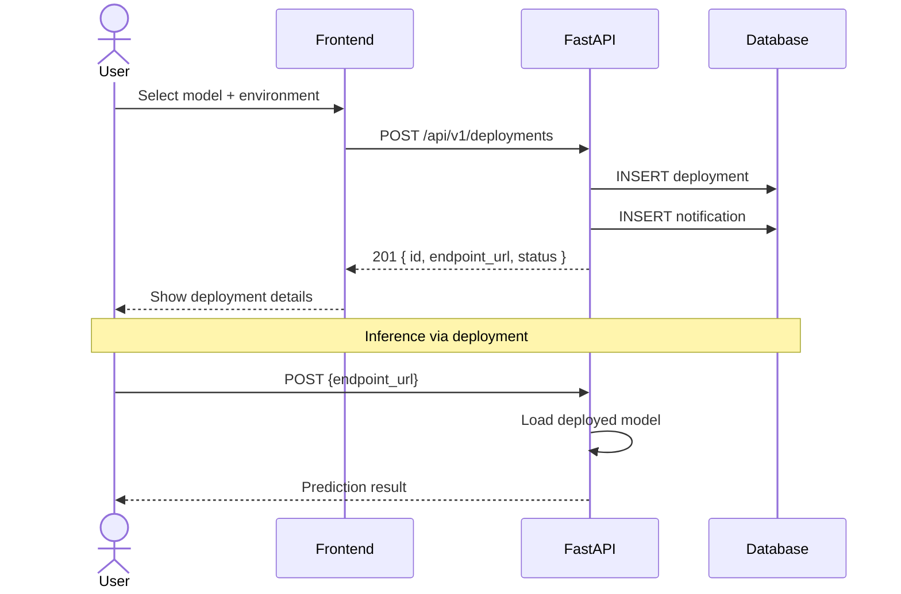
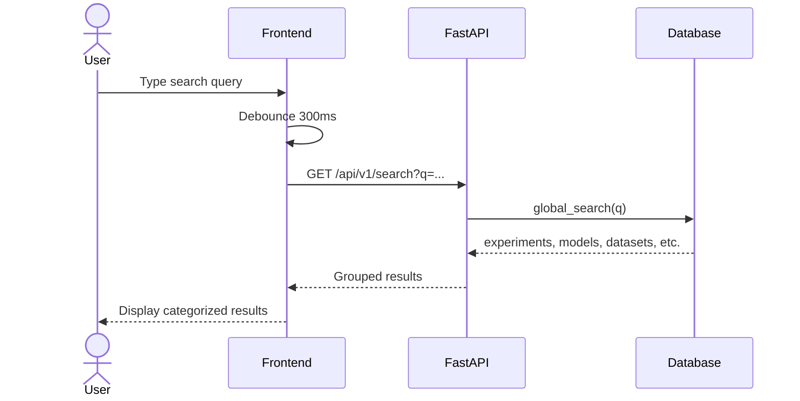

# Sequence Diagrams

## 1. User Registration & Authentication

```mermaid
sequenceDiagram
    actor User
    participant Frontend as React SPA
    participant API as FastAPI
    participant DB as Database

    User->>Frontend: Fill registration form
    Frontend->>API: POST /api/v1/auth/register
    API->>API: Hash password (bcrypt)
    API->>DB: INSERT users
    API-->>Frontend: 201 { id, email, name }
    Frontend-->>User: Show success

    User->>Frontend: Enter credentials
    Frontend->>API: POST /api/v1/auth/login
    API->>DB: SELECT user by email
    API->>API: Verify password hash
    API->>DB: CREATE user_session
    API-->>Frontend: 200 { access_token, user }
    Frontend->>Frontend: Store JWT in memory
    Frontend-->>User: Redirect to Dashboard
```

## 2. Training Flow

```mermaid
sequenceDiagram
    actor User
    participant Frontend
    participant API as FastAPI
    participant DB as Database
    participant ML as Training Engine

    User->>Frontend: Select dataset + target
    Frontend->>API: POST /api/v1/training
    API->>API: Validate inputs
    API->>ML: auto_preprocess(dataset, target)
    ML-->>API: X, y, preprocessor
    API->>ML: run_automl_training(X, y)
    ML->>ML: Train multiple models with CV
    ML-->>API: best_model, metrics, cv_score
    API->>DB: INSERT experiment
    API->>DB: INSERT model_registry
    API->>DB: INSERT notification
    API-->>Frontend: 200 { experiment, model, metrics }
    Frontend-->>User: Show training results
```

## 3. Prediction Flow

```mermaid
sequenceDiagram
    actor User
    participant Frontend
    participant API as FastAPI
    participant DB as Database

    User->>Frontend: Select model + input features
    Frontend->>API: POST /api/v1/predict
    API->>API: Load model from disk
    API->>API: make_prediction(features)
    API->>API: Optionally explain_prediction (SHAP)
    API->>DB: INSERT prediction_log
    API-->>Frontend: 200 { prediction, confidence, explanation }
    Frontend-->>User: Display prediction result
```

## 4. Deployment Flow

```mermaid
sequenceDiagram
    actor User
    participant Frontend
    participant API as FastAPI
    participant DB as Database

    User->>Frontend: Select model + environment
    Frontend->>API: POST /api/v1/deployments
    API->>DB: INSERT deployment
    API->>DB: INSERT notification
    API-->>Frontend: 201 { id, endpoint_url, status }
    Frontend-->>User: Show deployment details

    Note over User,DB: Inference via deployment
    User->>API: POST {endpoint_url}
    API->>API: Load deployed model
    API-->>User: Prediction result
```

## 5. Search Flow

```mermaid
sequenceDiagram
    actor User
    participant Frontend
    participant API as FastAPI
    participant DB as Database

    User->>Frontend: Type search query
    Frontend->>Frontend: Debounce 300ms
    Frontend->>API: GET /api/v1/search?q=...
    API->>DB: global_search(q)
    DB-->>API: experiments, models, datasets, etc.
    API-->>Frontend: Grouped results
    Frontend-->>User: Display categorized results
```
